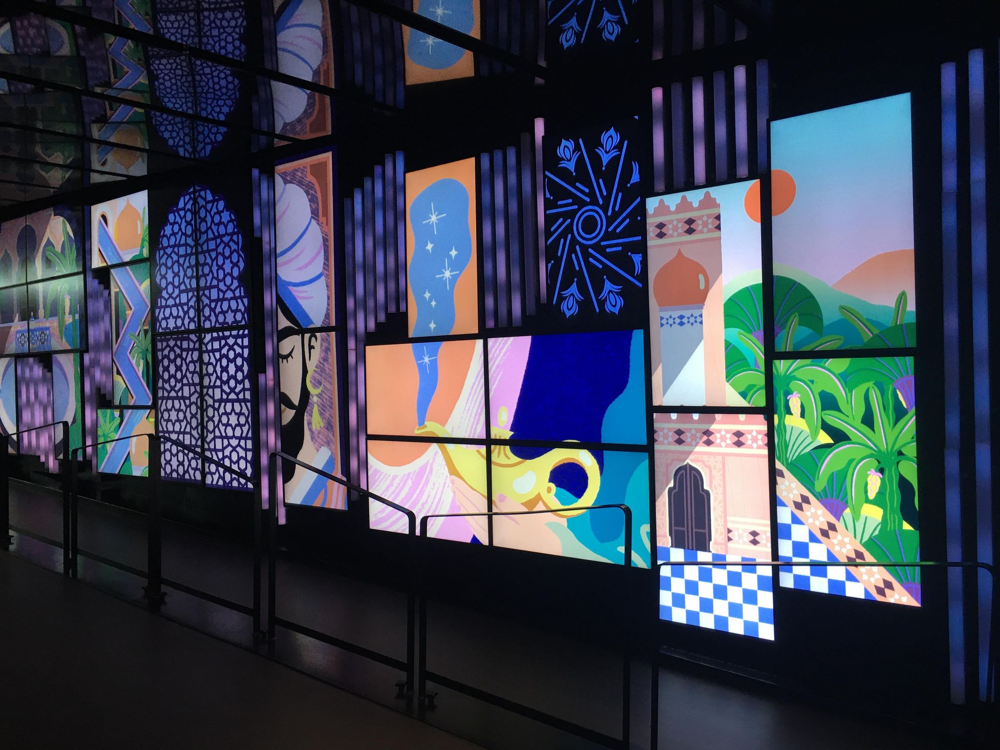
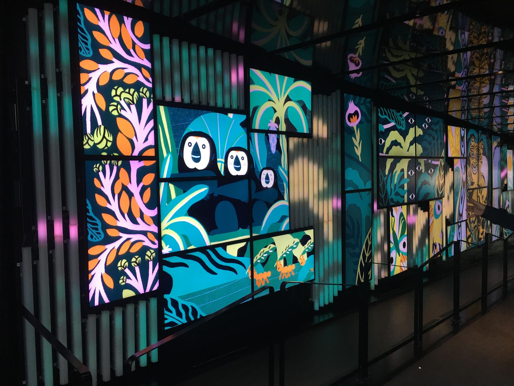

# Murale dans le corridor de la Place des Arts

Oeuvre Réalisée par Érick Villeneuve

Oeuvre réalisée dans les alentours de 2017 (très difficile à trouver)

Situé à la Place des Arts

Visité le 4 Mars 2022

## Description de l'oeuvre

La murale de la Place des Arts est composée de 35 écrans accompagés de plusieurs tubes en plastique transparents qui semblent changer de couleur en suivant l'animation qui y joue. Cette installation a été concue pour recevoir les animations de plusieurs artistes. Les animations qui y sont jouées sont généralement des animations qui montrent des cultures différentes à la nôtre associés de musique. Les animations qui y jouent sont toujours des dessins animés et non des photos/vidéos.  

</img>
</img>

## Explications sur la mise en espace

L'oeuvre se trouve sur un mur qui fait le long d'un corridor à la Place des Arts. Le corridor est relativement sombre et l'éclairage est dirigé vers les écrans
