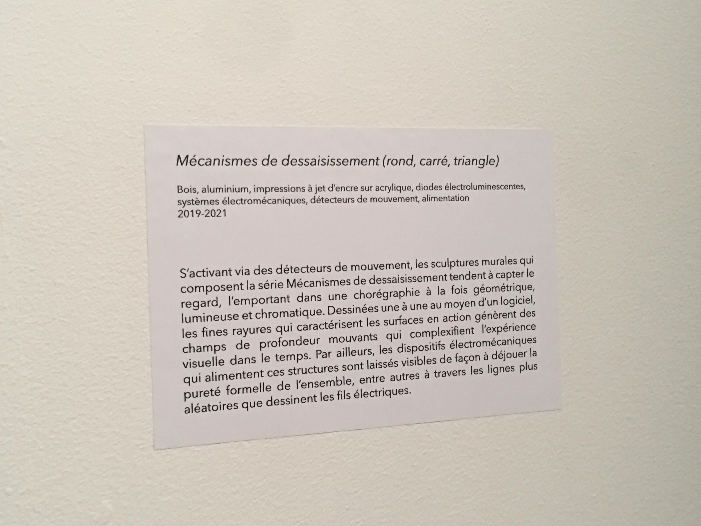
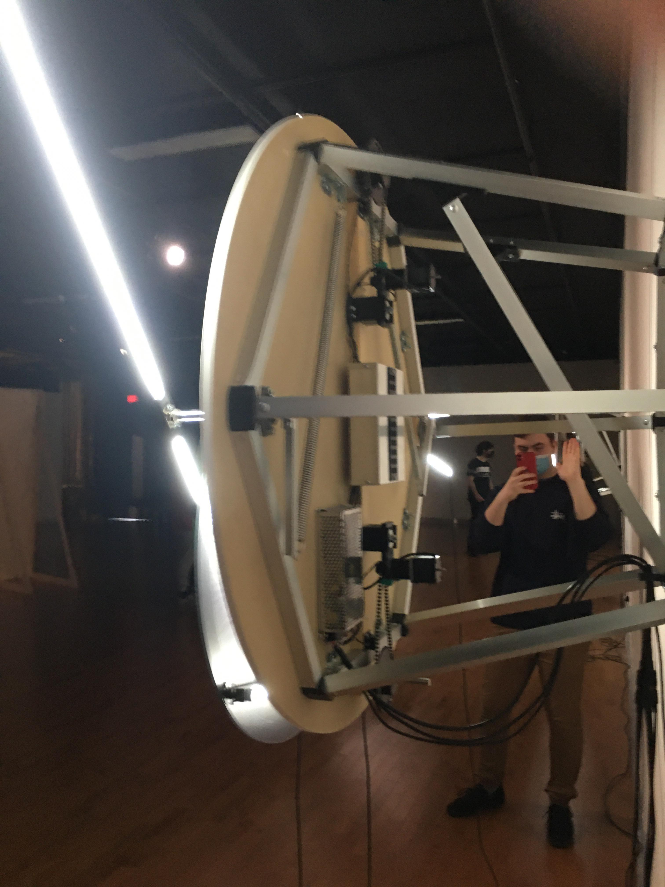

# Mécanismes de dessaisissement

Oeuvre réalisée par Béchard Hudon

Exposition: Configuration du sensible

Situé à la Maison des Arts de Laval

Visité le 17 mars 2021

## Description de l'oeuvre

L'oeuvre est composée de trois parties qui ont pratiquement la même fonction, mais qui sont concues différemment. La première partie est un carré, la deuxième est un triangle et le troisième est un cercle. Leur fonction est très simple: faire un mouvement constant, très lent qui le rend presque immobile vus de loin. Les mouvements des formes sont déterminés par le lieu où s'attache les tiges qui tournent. Si il n'y a aucune personne près de l'oeuvre, elle s'arrête après une période de temps. 

</img>
</img>
</img>
