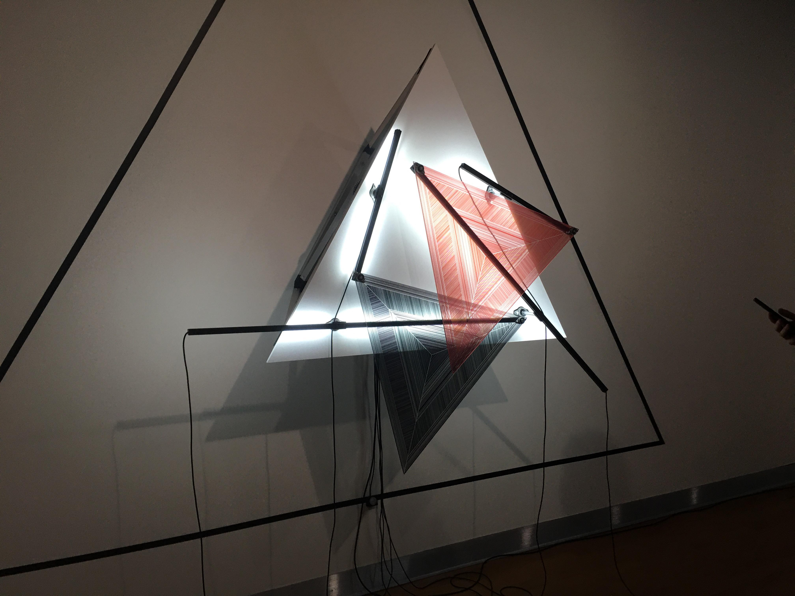
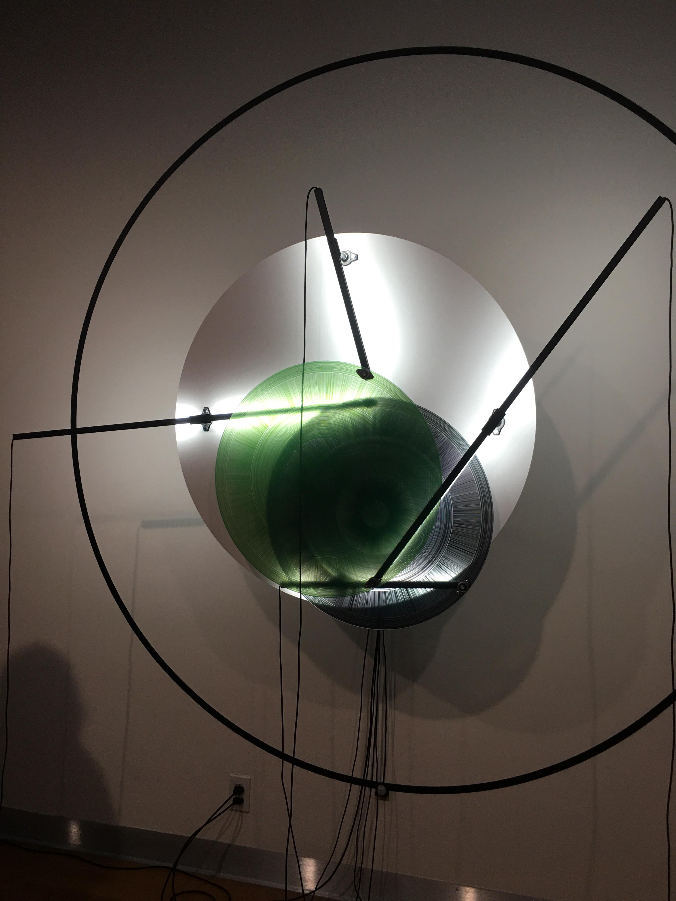

# Mécanismes de dessaisissement

Oeuvre réalisée par Béchard Hudon

Exposition: Configuration du sensible

Situé à la Maison des Arts de Laval

Visité le 17 mars 2021

## Description de l'oeuvre

L'oeuvre est composée de trois parties qui ont pratiquement la même fonction, mais qui sont concues différemment. La première partie est un carré, la deuxième est un triangle et le troisième est un cercle. Leur fonction est très simple: faire un mouvement constant, très lent qui le rend presque immobile vus de loin. Les mouvements des formes sont déterminés par le lieu où s'attache les tiges qui tournent. Si il n'y a aucune personne près de l'oeuvre, elle s'arrête après une période de temps. 

</img>
</img>
</img>

## Liste des composantes de l'oeuvre et techniques

### Facade

- Deux formes en plastique, un d'une couleur et l'autre noire
- Tiges qui quident les formes dans leur mouvement
- Câbles qui partent du bout des tiges
- Lumière derrière les tiges pour un éclairage très concentré
- Détecteur de mouvements sous l'oeuvre pour s'activer au mouvement du public

### Mécanisme

- Des Stepper motors pour créer un mouvement très précis et très fluide
- Power supply pour fournir l'oeuvre en électricité
- Contrôleur de moteurs pour faire fontionner les moteurs correctement

## Liste des éléments pour la mise en exposition (crochets, sac de sable, câbles de soutien...)

- Câdre en métal pour tenir l'oeuvre loin du mur
- Projecteurs dirigés vers les oeuvres produisant un éclairage doux

## Expérience vécue

L'oeuvre est très intéressante, le fait qu'on peut voir l'intérieur du mécanisme et que c'est entièrement volontaire est quelque chose que j'apprécie vraiment (tout comme les montres mécaniques transparentes par exemple). Il est aussi amusant de voir l'effet très spécial que les formes font quand elles sont alignées et qu'elles bougent. C'est une très belle oeuvre du côté conception également. Le fait que les fils ne se mêlent jamais est tout aussi intéressant et une belle réussite conte tenant à quel point il peut être difficile d'empêcher cela dans des oeuvres mécaniques comme celle-ci.
