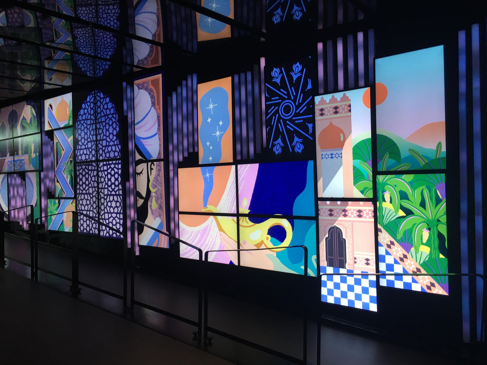
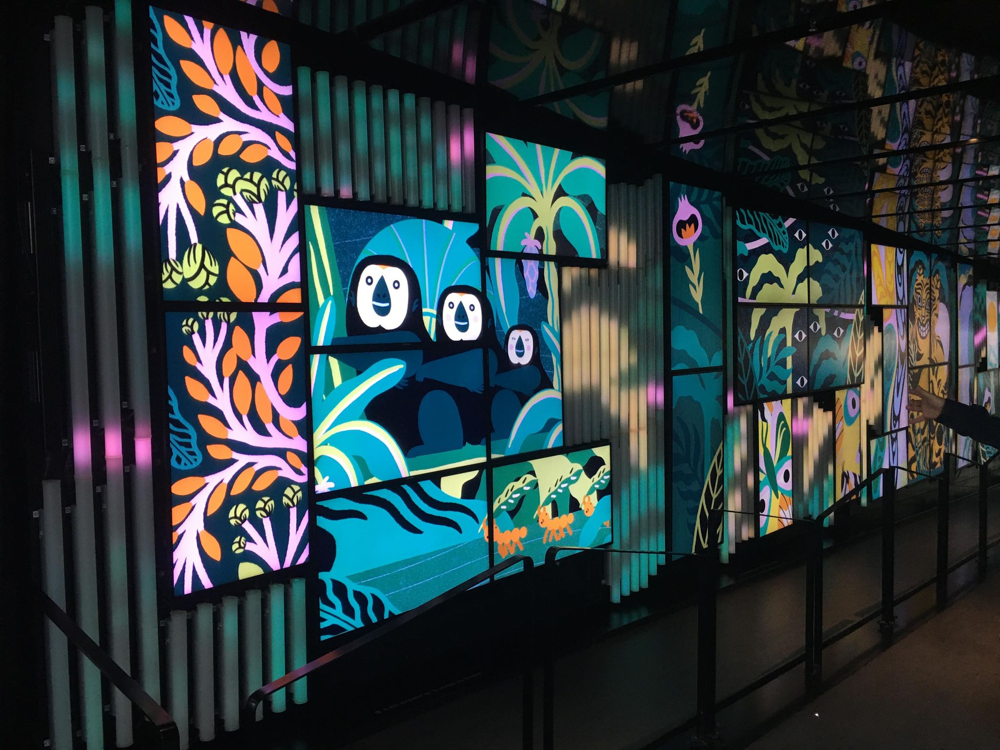

# Murale dans le corridor de la Place des Arts

Oeuvre Réalisée par Érick Villeneuve

Oeuvre réalisée dans les alentours de 2017 (très difficile à trouver)

Situé à la Place des Arts

Visité le 4 Mars 2022

## Description de l'oeuvre

La murale de la Place des Arts est composée de 35 écrans accompagés de plusieurs tubes en plastique transparents qui semblent changer de couleur en suivant l'animation qui y joue. Cette installation a été concue pour recevoir les animations de plusieurs artistes. Les animations qui y sont jouées sont généralement des animations qui montrent des cultures différentes à la nôtre associés de musique. Les animations qui y jouent sont toujours des dessins animés et non des photos/vidéos.  

</img>
</img>

## Explications sur la mise en espace

L'oeuvre se trouve sur un mur qui fait le long d'un corridor à la Place des Arts. Le corridor est relativement sombre et l'éclairage est dirigé vers les écrans. Des haut-parleurs sont installés près des écrans pour diffuser l'audio des animations de facon à ce qu'on doive s'approcher relativement proche des écrans. 35 écrans sont installés de facon à créer une grande mozaïque.

## Liste des composantes et techniques de l'oeuvre

- 35 écrans: ils sont connectés en ensemble pour former un seul écran de la longueur du corridor

- Haut parleurs: Ils diffusent la musique et les sons des animations qui jouent sur la murale.

- Tubes en plastique transparent: Semble contenir des bandes lumineuses DEL connectés au réseau d'écrans pous compléter l'animation.

## Liste des éléments pour la mise en exposition (crochets, sac de sable, câbles de soutien...)

- Supports pour écrans

- Clôture pour éviter les visiteurs d'y toucher

- Projecteurs proche des écrans pour une lumière douce

## Expérience vécue

L'oeuvre est très intéressante pour sa conception, tout comme pour les animations qui y jouent. L'agencement des tubes et des écrans est très bien concu, de facon à ce que les tubes complètent bien les animations avec les écrans adjacents. Les animations qui y jouent sont concus pour fonctionner avec la mozaïque et sont faits par de multiples artistes différents. Il est un peu dommage cependant, que ce n'est pas une liste d'animations qui jouent, mais c'est plutôt une seule oeuvre qui joue pendant une certaine période de temps. Ca ruine un peu le potentiel de l'oeuvre.
